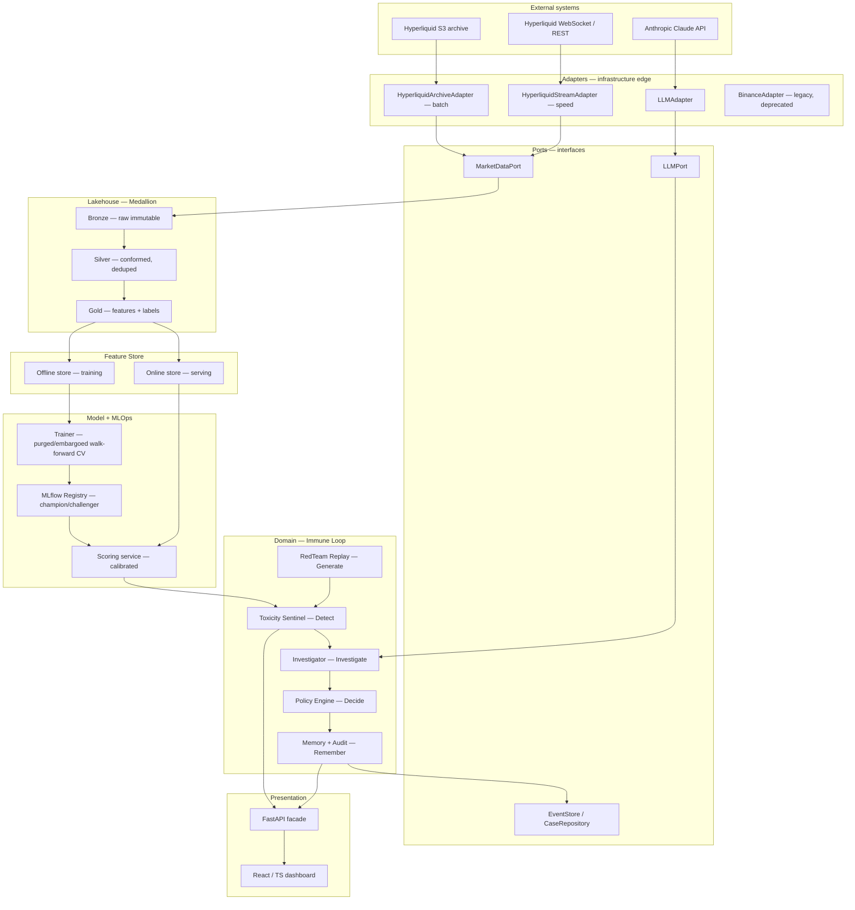
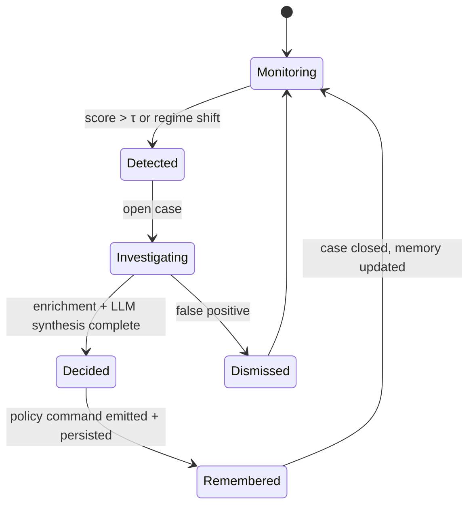

# MarketImmune v2 — Refactor & Architecture Plan
### Rebasing the immune system from simulated CEX flow onto real on-chain microstructure

---

## 0. Thesis

MarketImmune **v1** detects "risk" in *simulated* Binance flow, where the adversarial scenarios are generated by its own RedTeam agent. That makes the headline 0.989 PR-AUC a measurement of the **generator**, not the market — a label-leakage artifact that will not survive a quant interview.

MarketImmune **v2** keeps the differentiated domain — the *Generate → Detect → Investigate → Decide → Remember* immune loop and its agent cast — but rebases it onto **real Hyperliquid perpetual-swap microstructure** and redefines the learning target as **adverse selection (toxic order flow)**, a signal with *millions* of point-in-time labels per week.

The migration is executed as an **incremental Strangler-Fig** refactor behind a **Ports-and-Adapters (Hexagonal)** boundary, so the domain core is preserved while the data substrate, label definition, feature pipeline, and evaluation protocol are replaced. The headline metric is *expected to drop* into an honest range — and that honesty, made structurally enforceable by the architecture, is the actual deliverable.

---

## 1. Refactor philosophy (the four invariants)

**1.1 Strangler Fig over big-bang rewrite.** New v2 paths are introduced behind feature flags and run *in parallel* with v1; legacy paths are retired only after the v2 equivalent passes acceptance in shadow. At no point does the system stop working. This is the canonical incremental-migration pattern (Fowler) and it is what makes a refactor of a live system safe and reversible.

**1.2 Hexagonal architecture is the enabling decision.** The Binance → Hyperliquid swap is *the reason the refactor is tractable*: the domain depends only on infrastructure-agnostic **ports** (interfaces), and v1's Binance code and v2's Hyperliquid code become interchangeable **adapters** behind the same `MarketDataPort`. The data source stops being load-bearing.

**1.3 Preserve the domain, replace the substrate.** The immune loop, the LangGraph agent cast (Sentinel / Investigator / Policy / Memory / RedTeam), and the append-only audit trail are the differentiator and stay intact. What gets rebuilt: data source, feature engineering, label definition, cross-validation protocol, calibration, and resilience.

**1.4 Leakage-proof by construction.** Every choice in the data and model layers — feature store, point-in-time as-of joins, purged-and-embargoed cross-validation — exists to make look-ahead bias *structurally impossible* rather than something you hope you avoided. This is the direct architectural antidote to v1's credibility problem.

---

## 2. Target architecture

A layered hexagon: a pure domain core, surrounded by ports, with all I/O pushed to the edges as adapters. Data flows through a **Medallion** lakehouse and a **Feature Store** before reaching the model and the immune loop.



The dependency rule points inward: adapters depend on ports, the domain depends on nothing external. Swapping Hyperliquid for any other venue (or restoring Binance) is a new adapter, not a domain change.

---

## 3. Module catalog

| Module | Responsibility | Primary pattern(s) | Your stack |
|---|---|---|---|
| Source adapters | Pull archive (batch) + live (stream) data; normalize to canonical schema | **Adapter**, **Strategy** (source selection), **Factory** | `boto3`, `websockets`, Pydantic data contracts |
| Ingestion orchestrator | Idempotent, incremental loads; late-data watermarking | **Pipes & Filters** | Python; Prefect/Dagster *or* cron + GitHub Actions |
| Lakehouse | Bronze → Silver → Gold layering | **Medallion** | Parquet + DuckDB (local) / Snowflake (warehouse story) |
| Feature Store | Point-in-time feature retrieval, offline + online parity | **Feature Store**, as-of join | DuckDB offline / in-proc or Redis online; one shared transform lib |
| Labeler | Compute markout / adverse-selection labels | **Strategy** (horizon, vol-normalized variants) | Polars / pandas |
| Trainer | Fit model under leakage-safe CV | **Pipeline (Template Method)** | CatBoost, scikit-learn, MLflow |
| Calibrator + evaluator | Wrap raw model with probability calibration; score metrics | **Decorator**, **Strategy** (isotonic / Platt) | sklearn, Brier / reliability |
| Registry + serving | Version, promote, serve the champion; A/B challengers | **Model Registry**, champion/challenger, **shadow** | MLflow Registry, FastAPI endpoint |
| Toxicity Sentinel | Subscribe to scored-fill stream; threshold / detect regime shift | **Observer** | FastAPI async |
| Investigator | Multi-stage enrichment → wallet trace → cross-ref → LLM synthesis | **Chain of Responsibility** | LangGraph + Claude |
| Policy Engine | Emit auditable actions (widen / pull / flag) | **Command**, **Strategy** (policy variants) | Python |
| Memory + Audit | Append-only event log; reconstruct state; read-optimized views | **Event Sourcing** + **Repository**, **CQRS** | Django ORM (write/event store) + read models |
| RedTeam (repurposed) | Replay + perturb *real* historical toxic episodes as stress scenarios | **Strategy**, replay | Python; reads Gold scenario tables |
| Case lifecycle | Govern case state transitions | **State machine (FSM)** | `django-fsm` or explicit FSM |
| API facade | Single entry point over domain services | **Facade**, data contracts | FastAPI + Pydantic |
| Dashboard | Live scores, case narratives, audit replay | **Observer / pub-sub**, CQRS read side | React / TS, WebSocket |
| Resilience layer | Protect remote calls (Hyperliquid, Claude) | **Circuit Breaker**, **Retry w/ backoff + jitter**, **Bulkhead** | `tenacity` / custom |
| Config & wiring | Construct adapters/strategies from environment | **12-Factor**, **Abstract Factory** | `pydantic-settings`, env vars |

---

## 4. Data architecture

**4.1 Medallion lakehouse.** *Bronze* is the raw, immutable landing of Hyperliquid fills, L2 book snapshots, liquidations, funding, and HLP-vault state, partitioned by `asset/date/hour`. *Silver* conforms types, deduplicates, and aligns timestamps to a single monotonic clock. *Gold* holds the point-in-time feature matrix and the markout labels — the only layer the model and dashboard read.

**4.2 Batch + speed layers (Lambda).** The free S3 archive feeds the **batch layer** (comprehensive, reproducible backfill); the WebSocket feed powers the **speed layer** (low-latency, real-time). The serving view reconciles them. (Kappa — stream-only — is the alternative; Lambda is the right call here precisely because a true historical archive exists.)

**4.3 Data contracts.** Every adapter validates output against a Pydantic schema at the boundary. A malformed or schema-drifted payload fails loudly in Bronze rather than silently corrupting Gold.

**4.4 Idempotent incremental ingestion.** Loads are keyed and replayable with at-least-once delivery plus idempotent upserts, so a re-run or a crash never double-counts. Late/out-of-order events are handled with **watermarking** in the speed layer.

---

## 5. Feature & label engineering — the credibility core

**5.1 Label = markout (realized adverse selection).** For each *maker* fill at time `t`, side `s`, price `p`:

```
markout(h) = sign(s) * (mid_{t+h} − p) / p        for h ∈ {1s, 10s, 60s}
toxic(h)   = 1 if markout(h) < −fee_threshold else 0
```

A negative fee-adjusted markout means the maker was picked off. Start with calibrated binary classification; keep the continuous markout for a regression head later. Because the label spans a forward horizon `h`, **labels overlap in time** — which *mandates* the purging/embargo discipline in §6.

**5.2 Feature taxonomy (all strictly as-of `t`).**
- **Book state:** multi-level order-book imbalance, microprice vs. mid, depth/slope, spread, relative tick size.
- **Flow:** signed order-flow imbalance (OFI), trade size vs. resting depth, aggressor ratio.
- **Derivatives state:** funding rate and its rate-of-change, open-interest delta, perp-vs-oracle basis.
- **Stress:** rolling liquidation intensity + directionality, short-horizon realized vol, vol-of-vol.
- **Context:** maker queue-position proxy, session/time-of-day, asset liquidity tier.

**5.3 Point-in-time correctness.** Every feature is produced by an **as-of join** that uses only information available at or before the fill timestamp. A hard invariant — `max(feature_ts) ≤ fill_ts` — is asserted in tests. No forward bars, no future aggregates.

**5.4 Train/serve parity.** The offline (training) and online (serving) feature paths call the **same transformation library**. This is the structural defense against train/serve skew — the most common reason a model that backtests well dies in production.

---

## 6. Model & evaluation (MLOps)

**6.1 Model.** Gradient-boosted trees (CatBoost) over the engineered features — handles the heterogeneity and gives feature importances you can defend in an interview. A small PyTorch sequence head is a stretch goal, not the MVP.

**6.2 Cross-validation — purged & embargoed walk-forward.** Splits are strictly temporal (never shuffled). Because markout labels overlap, any training sample whose `[t, t+h]` label window intersects a test fold is **purged**, and an **embargo** buffer is applied after each test fold to break residual serial correlation (the López de Prado protocol for financial ML). *This single technique is the direct fix for the v1 0.99 illusion.*

**6.3 Calibration.** Wrap the raw classifier with isotonic (or Platt) calibration so the toxicity score is a usable probability. Validate with **Brier score** and a **reliability diagram**, not just discrimination metrics.

**6.4 Metric suite (in priority order).**
1. **Realized markout improvement (bps)** on out-of-sample fills under a quoting policy that widens/withholds when `score > τ`, vs. an always-quote baseline — the economically meaningful number.
2. **PR-AUC** (the labels are imbalanced); ROC-AUC secondary.
3. **Calibration** (Brier + reliability).
4. **Lift over trivial baselines** (OFI-only, book-imbalance-only) — proves the model beats a one-liner.

Expect *modest, honest* lift. That is the point.

**6.5 Lifecycle.** MLflow tracks experiments and lineage; the **Model Registry** governs promotion. New models enter as **challengers**, run in **shadow** against the champion, and are promoted via **canary** only after passing acceptance. **Concept/data drift** is monitored with PSI / KS tests on feature and score distributions, triggering retraining — which is what the *Remember* step feeds.

---

## 7. The immune loop (domain layer)

The loop is a finite state machine; each state maps to one LangGraph agent.



- **Detect (Sentinel).** An **Observer** on the scored-fill stream opens a case when toxicity crosses `τ` or a regime shift is detected.
- **Investigate (Investigator).** A **Chain of Responsibility**: handlers enrich the event in sequence — identify counterparty, trace wallets, cross-reference concurrent funding/liquidation stress — then Claude synthesizes a narrative. New evidence type ⇒ new handler, no rewrite.
- **Decide (Policy Engine).** Each action (widen spread, pull quotes, flag) is a **Command** object — making decisions queueable, auditable, and replayable. Competing policies are swappable via **Strategy**.
- **Remember (Memory + Audit).** **Event Sourcing**: every trace, tool call, and decision is an immutable appended event; current state is a replay of the log. **CQRS** separates this write/event model from the read-optimized projections the dashboard queries.
- **Generate (RedTeam, repurposed).** Instead of fabricating adversarial flow, it **replays and perturbs real historical toxic episodes** (e.g., the October-2025 cascade, the JELLY playbook) from the Gold scenario tables as stress tests — same concept, now grounded in reality.

---

## 8. Resilience, configuration & delivery

- **Circuit Breaker** trips on repeated Hyperliquid/Claude failures to prevent cascading timeouts; **Retry with exponential backoff + jitter** absorbs transient errors and rate limits; **Bulkhead** isolates the ingestion, scoring, and LLM subsystems so one saturating does not starve the others.
- **12-Factor** configuration: every credential, endpoint, and feature flag is environment-injected; the **Abstract Factory** wires the correct adapters/strategies at startup from config.
- **Delivery:** Dockerized services, GitHub Actions CI (lint, type-check, the point-in-time and leakage invariants as tests, then build), reproducible from a single command.
- **Observability:** structured logs, the event log itself as an audit substrate, and SLOs on inference p95 latency and ingestion freshness.

---

## 9. Migration plan (phased Strangler Fig)

| Phase | Goal | Key actions | Exit criteria | Rollback |
|---|---|---|---|---|
| **0 — Seam** | Make v1 swappable without changing behavior | Wrap Binance logic behind `MarketDataPort` + repositories; add data contracts | Tests green; v1 behaves identically through ports | Trivial — no behavior changed |
| **1 — Backfill** | Stand up Hyperliquid data, off by default | `HyperliquidArchiveAdapter`; build Bronze→Gold for N assets behind a flag | Gold features/labels reproducible + schema-valid | Flag off |
| **2 — Shadow** | Validate v2 without acting on it | Swap labeler to markout; train v2; run v2 scoring in **shadow** beside v1; no live actions | v2 calibration + markout-lift acceptance met | v1 remains champion |
| **3 — Cutover** | Promote v2, repurpose RedTeam | Registry-promote v2 to champion; retire synthetic RedTeam → historical replay; attach live speed layer | v2 champion stable; audit intact | Champion/challenger flip back to v1 |
| **4 — Harden** | Production-grade ops | Resilience patterns, drift monitors, CI gates, dashboards, docs | SLOs (p95 latency, freshness) met | n/a |

Each phase is independently shippable and reversible — the defining property of a strangler-fig migration.

---

## 10. Anti-patterns to avoid (leakage checklist)

- **Look-ahead bias** → as-of joins only; assert `max(feature_ts) ≤ fill_ts`.
- **Overlapping-label leakage** → purge + embargo in CV (the direct fix for the 0.99 trap).
- **Train/serve skew** → a single shared transformation library on both paths.
- **Forward-looking features** → ban any feature derived from `t > fill_ts`.
- **Non-stationary evaluation** → strictly temporal CV; never random-shuffle financial series.
- **Survivorship/selection bias** → include illiquid/delisted assets where data permits; document universe construction.
- **Metric over-claiming** → report calibration and economic lift, not PR-AUC alone.

---

## 11. What each decision signals to the firms

- **Wintermute** — adverse selection *is* their core daily problem; OFI, markout, feature-store parity, and point-in-time correctness are literally the vocabulary of a market-signal developer, and the resilience/low-latency serving layer speaks to their infra team.
- **Jump Crypto** — honest measurement on noisy, incomplete on-chain data plus research-grade, agent-authored post-mortems is exactly the research disposition they hire for.
- **Snowflake** — a Medallion lakehouse with warehouse-served Gold tables and explicit data contracts demonstrates real data-platform fluency.

---

*Headline to internalize: v1 sold a 0.99 that smells synthetic; v2 sells an honest number that an interviewer cannot break — because the architecture makes the leakage impossible, not merely absent.*
