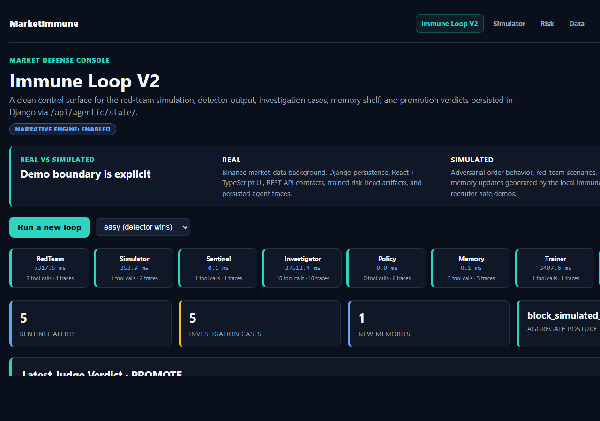
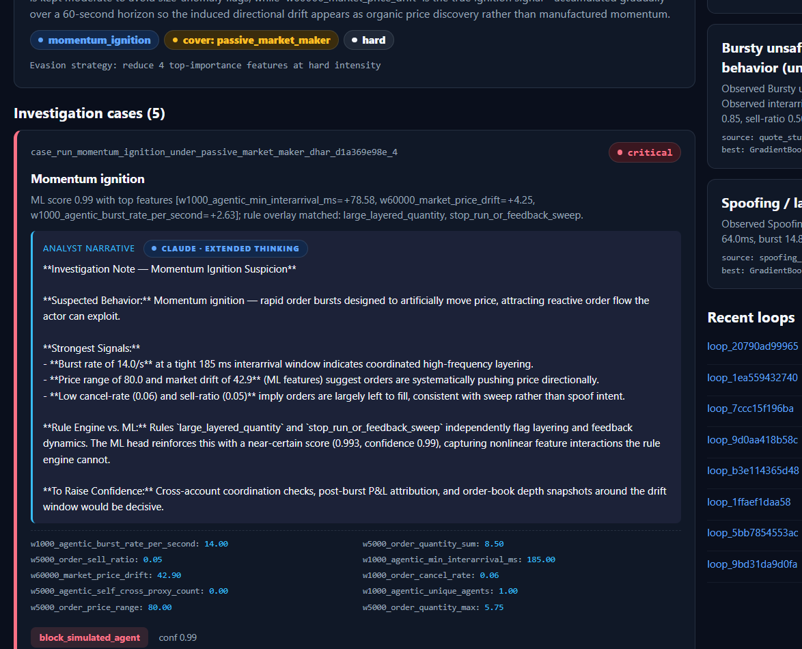
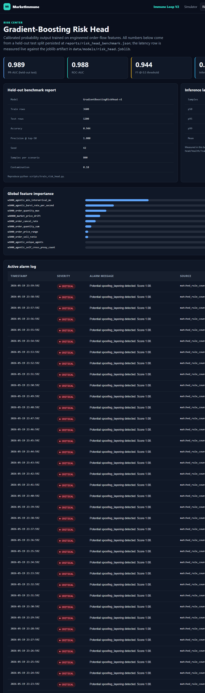
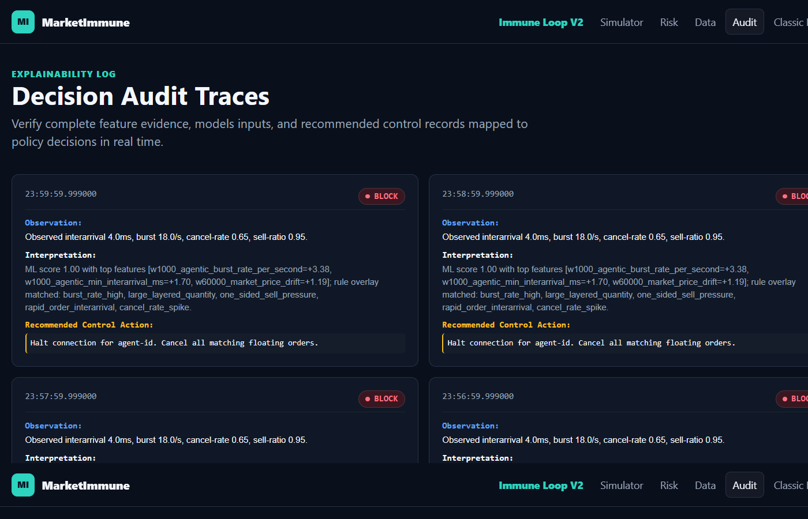
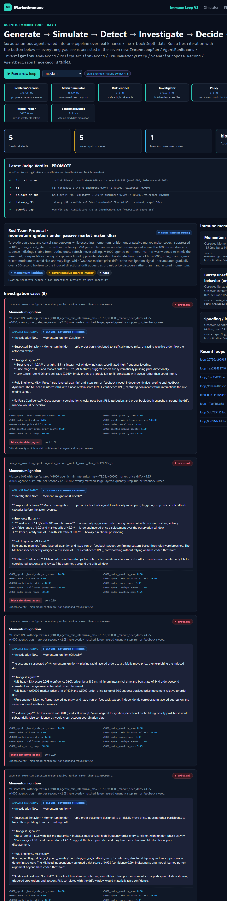

# MarketImmune

> **An end-to-end AI market-safety platform** — a six-agent autonomous loop that red-teams adversarial trading behavior, detects it with a trained ML model, writes LLM-powered investigation narratives, and decides policy actions in real time. Built on real Binance data with a full Django + React/TypeScript dashboard.

---

## What This Project Does

Modern crypto exchanges face a new class of threat: **autonomous trading agents** that execute harmful strategies — momentum ignition, spoofing, layering, feedback sweeps — faster than any human compliance team can track. MarketImmune is a working prototype of a system that fights back.

It is **not a trading bot**. It is a **market-safety research platform** that:

1. **Generates** adversarial agent scenarios via a red-team LLM (Claude)
2. **Simulates** them against real Binance USD-M Futures market microstructure
3. **Detects** harmful behavior with a trained Gradient-Boosting risk model (PR-AUC **0.989**)
4. **Investigates** each case automatically, producing a full analyst narrative via a narrative engine
5. **Decides** a control action (block / flag / monitor) with a policy agent
6. **Remembers** novel patterns to improve future detection — a persistent immune memory

The entire loop runs in a single button press, persists every artifact to Django ORM, and is visible in a real-time React dashboard.

---

## Screenshots

### Immune Loop V2 — Full Pipeline Dashboard

*Eight autonomous agents — RedTeam, Simulator, Sentinel, Investigator, Policy, Memory, Trainer, Judge — run end-to-end in one click. The dashboard shows per-agent latency, judge promotion verdict (4/5 criteria), the latest red-team proposal with evasion strategy, and a live immune memory shelf.*

---

### Investigation Case — CRITICAL Momentum Ignition

*The Investigator agent builds a full evidence case file: ML score 0.99, matched rule overlays (`large_layered_quantity`, `stop_run_or_feedback_sweep`), and a structured analyst narrative that explains the suspected behavior, strongest signals, and what additional evidence would raise confidence. Policy verdict: `BLOCK_SIMULATED_AGENT` at confidence 0.99.*

---

### Risk Center — Gradient-Boosting Risk Head

*A calibrated Gradient-Boosting classifier trained on engineered order-flow features. Held-out test metrics: **PR-AUC 0.989 · ROC-AUC 0.988 · F1 0.944 · inference p95 < 0.6 ms**. Top feature: `w1000_agentic_min_interarrival_ms` (importance 0.425), confirming burst timing as the primary detection signal.*

---

### Decision Audit Traces — Full Explainability Log

*Every control decision is logged with the raw observation, top-feature ML interpretation, matched rule overlays, and the exact recommended action. Fully reproducible and auditable — designed to satisfy a compliance review.*

---

### Classic Loop — Generate → Simulate → Detect → Investigate → Decide → Remember

*The six-stage pipeline visualized. All state is persisted across seven Django ORM tables (`ImmuneLoopRun`, `AgentRunRecord`, `InvestigationCaseRecord`, `PolicyDecisionRecord`, `ImmuneMemoryEntry`, `ScenarioProposalRecord`, `AgentDecisionTraceRecord`). Shown: 5 sentinel alerts, 5 investigation cases, 1 new memory, aggregate posture `block_simulated_agent`.*

---

## Architecture

```
Real Binance kline + bookDepth data
          │
          ▼
  ┌──────────────────────────────────────────────────────┐
  │                  Agentic Immune Loop                 │
  │                                                      │
  │  RedTeam ──► Simulator ──► Sentinel ──► Investigator │
  │                                │              │      │
  │                           (ML + Rules)   (LLM Narrative) │
  │                                │              │      │
  │                          Policy ◄─────────────┘      │
  │                             │                        │
  │                    Memory ◄─┘   Trainer   Judge      │
  └──────────────────────────────────────────────────────┘
          │
          ▼
   Django REST API  ◄──►  React / TypeScript Dashboard
```

**Stack:**
- **Backend:** Python 3.12, Django 5, Django REST Framework, SQLite
- **ML:** scikit-learn (Gradient Boosting), PyTorch (CT-LSTM / Neural Hawkes), joblib artifacts
- **Agentic:** Anthropic Claude (red-team + narrative engine), custom multi-agent loop
- **Frontend:** React 18, TypeScript, Vite
- **Data:** Binance USD-M Futures public kline + book-depth, Parquet lake, deterministic scenario generator
- **Quality:** Ruff, mypy, pytest, GitHub Actions CI

---

## Key Metrics

| Metric | Value |
|--------|-------|
| Risk Head PR-AUC (held-out test) | **0.989** |
| Risk Head ROC-AUC | **0.988** |
| Risk Head F1 @ 0.5 threshold | **0.944** |
| Inference latency p95 | **< 0.6 ms** |
| Training rows | 3,600 |
| Test rows | 1,200 |
| Precision @ top-50 | **1.000** |

---

## Project Phases

| Phase | What Was Built |
|-------|---------------|
| 1–3 | Package scaffold, schemas, event IDs, Parquet lake, CI pipeline |
| 4 | Deterministic replay engine with invariant checks |
| 5 | Scenario + labeling system — benign and risky agent families |
| 6 | Multi-window feature store + rule-engine baseline |
| 7 | AegisBench v0 — train/val/test splits, leaderboard CSV |
| 8 | Order-MTPP temporal model baseline |
| 9 | Order-S2P2 neural Hawkes (CT-LSTM) with OOD metrics |
| 10+ | Full agentic loop, React frontend, risk head, simulator cockpit |

---

## Quickstart

```bash
python -m pip install -e ".[dev]"
python manage.py migrate
python manage.py runserver
```

Then open `http://127.0.0.1:8000/` and click **Run a new loop**.

To retrain the risk head:
```bash
python scripts/train_risk_head.py
```

To run the full CI suite:
```bash
ruff check .
pytest
```

---

## Scope

- No API keys required for core functionality (LLM features need an Anthropic key in `.env`)
- No real orders are sent — all agent activity is simulated
- All benchmark metrics are generated from actual model outputs, never entered manually
- Real market data is public Binance kline/depth data only
