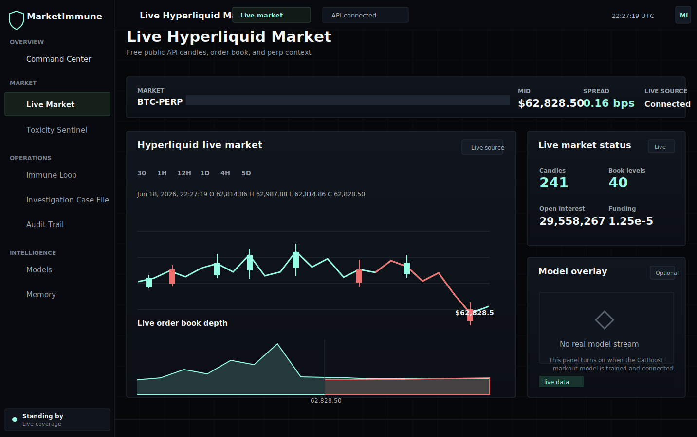

# MarketImmune

**Agentic market-safety research platform for crypto perpetuals.**
MarketImmune combines a terminal-style dashboard, an audited multi-agent immune
loop, exchange-data ingestion groundwork, markout labeling primitives, and
leakage-safe evaluation into one research workspace.




## What It Does

MarketImmune is a research prototype for detecting adverse selection and toxic
order flow in crypto perpetual markets. It is built around an immune-loop model:

```text
Generate -> Detect -> Investigate -> Decide -> Remember
```

The system is designed for market-structure monitoring, agentic investigations,
append-only decision audit trails, and real markout-based model evaluation.

## Current Status

This is a research system, not a live trading system.

What is live today in this repository:

- **React/Django market dashboard** with simulator, risk, model, memory, audit,
  and agentic-loop screens.
- **Django API surface** for `/api/live/tick/`, simulator state/control,
  risk-head health, and agentic loop state/run endpoints.
- **Agentic immune loop** with structured traces and append-only audit records.
- **Exchange ingestion groundwork** for public market-data files and replay
  inputs.
- **Markout labeling and evaluation primitives** for future real-data model
  training.
- **Leakage-aware evaluation tools** including purged/embargoed walk-forward
  splits, calibration metrics, and promotion policy checks.
- **Quality gates**: ruff, mypy, pytest, and a 95%+ coverage gate in CI.

What is still preview:

- Agent/model dashboard views still include labeled fixtures.
- Hyperliquid-specific live endpoints are part of the v2 integration work and
  should not be treated as merged API surface until they land in `dashboard/`.
- The current risk head trains on synthetic scenario data, not real exchange
  fills.
- The CatBoost markout model and measured bps lift require historical exchange
  backfill and a training run.

The remaining roadmap is summarized below so the README stays self-contained.

## Highlights

- **Professional trading terminal UI**: dark Hyperliquid-inspired command
  surface, live ticker strip, candle chart, depth view, and dense data panels.
- **Auditable agents**: each stage emits structured `AgentRun`, `ToolCall`, and
  `DecisionTrace` records.
- **Market-data path**: exchange ingestion and lakehouse scaffolding already
  exist; Hyperliquid archive wiring is tracked in the roadmap.
- **ML research stack**: gradient-boosting risk head today, CatBoost markout
  evaluation path planned once real Gold rows exist.
- **Honesty-first metrics**: no hard-coded market claims; resume-grade numbers
  wait for measured real-data reports.

## Architecture

```text
marketimmune/         Python core: agents, ingestion, labels, models, replay
dashboard/            Django REST API, ORM audit trail, static React host
frontend/             React + TypeScript + Vite terminal UI
aegisbench/           Benchmark tasks, splits, metrics, and reports
scripts/              Training, metrics, and verification CLIs
tests/                Unit, integration, parser, model, and dashboard tests
```

Python core code has no Django dependency. Django owns persistence and API
hydration. The React app can run static-first, then hydrate live slices when the
Django API is reachable.

## Quickstart

Install backend dependencies and start Django:

```powershell
python -m pip install -e '.[dev]'
python manage.py migrate
python manage.py runserver 127.0.0.1:8000
```

Open the current single-origin app:

```text
http://127.0.0.1:8000/dashboard/live/#/live
```

Current JSON endpoints include `/api/live/tick/`, `/api/simulator/state/`,
`/api/simulator/control/`, `/api/risk-head/health/`, and `/api/agentic/state/`.

For active frontend development:

```powershell
npm.cmd run setup:frontend
npm.cmd run dev:frontend
```

Then open:

```text
http://127.0.0.1:5173/#/live
```

Do not use `npm run preview` for live API testing. Static preview does not proxy
`/api`.

## Useful Commands

Run the full backend gate:

```powershell
python -m coverage run -m pytest
python -m coverage report -m
```

Run lint/type/build checks:

```powershell
ruff check .
mypy
npm.cmd run typecheck
npm.cmd run build
python manage.py check
python manage.py makemigrations --check --dry-run
```

Train the current synthetic-data risk head:

```powershell
python scripts/train_risk_head.py
```

## Roadmap

The remaining high-value work is real-data execution:

- Confirm the exact Hyperliquid `node_fills_by_block` archive schema.
- Run the requester-pays historical backfill.
- Assemble Bronze/Silver/Gold rows with point-in-time features and markout
  labels.
- Train CatBoost under purged/embargoed walk-forward CV.
- Report measured markout lift in bps versus an OFI-only baseline.
- Wire the trained model stream back into the live product loop.

## Scope Notes

- No real orders are sent.
- No private key or exchange account is required for the current dashboard.
- LLM access is optional for richer agent reasoning; deterministic fallbacks
  work without external model access.
- Do not cite market-performance claims until the real historical training run
  produces a measured report.
