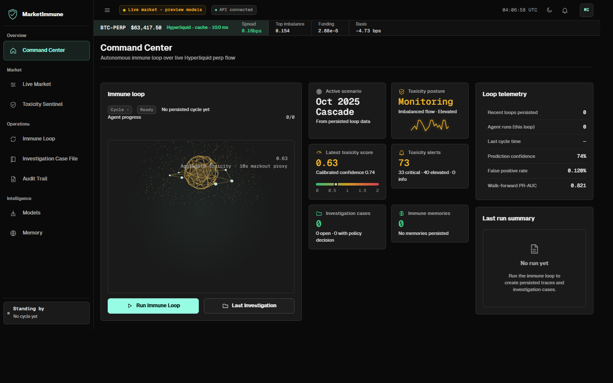
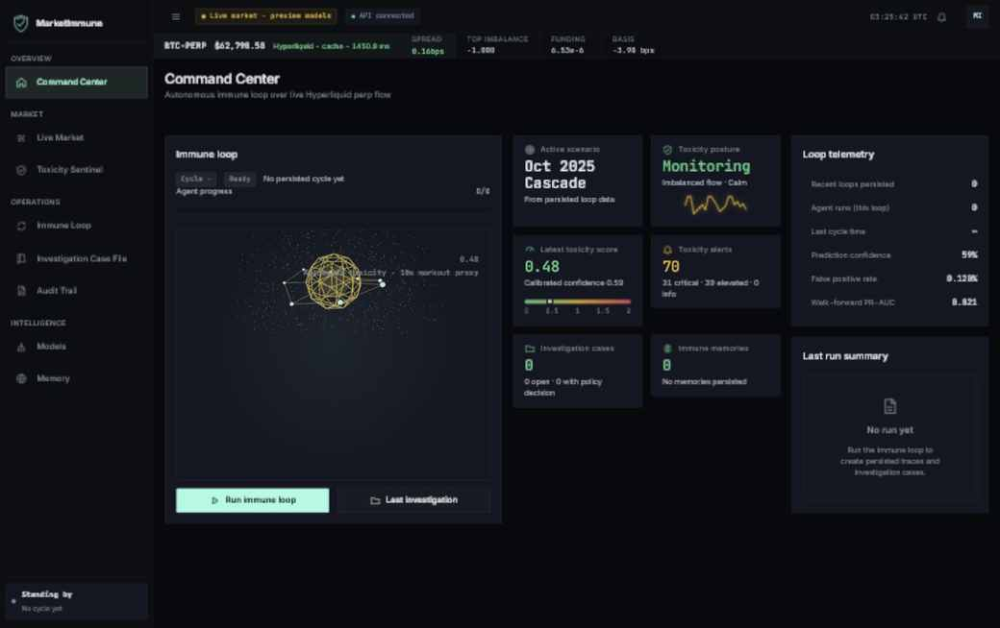
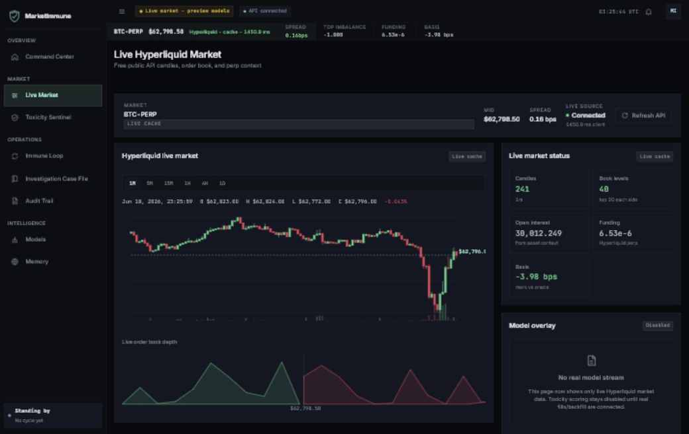
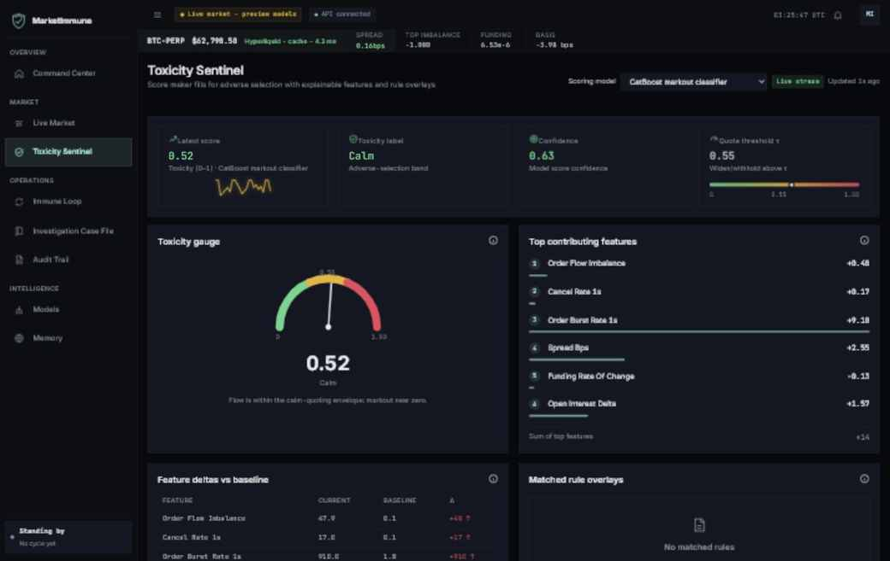
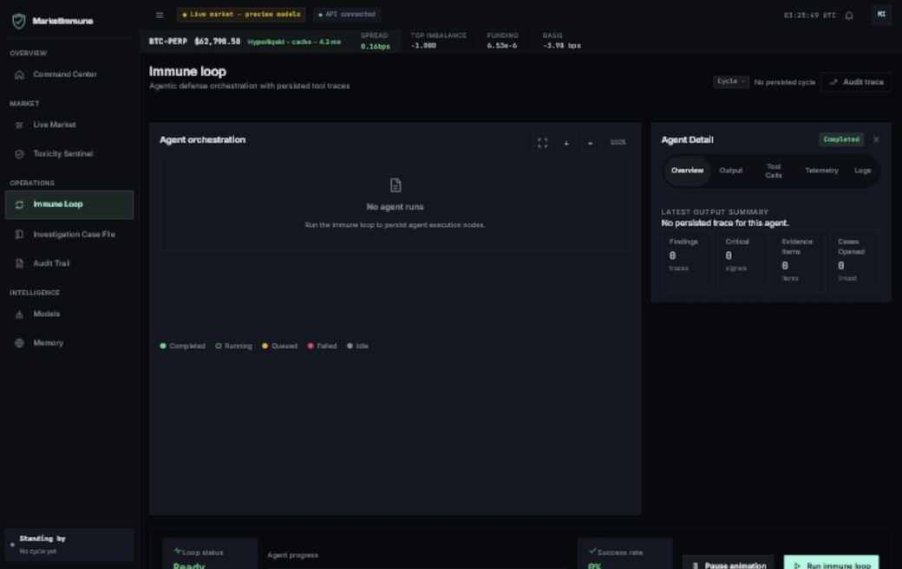
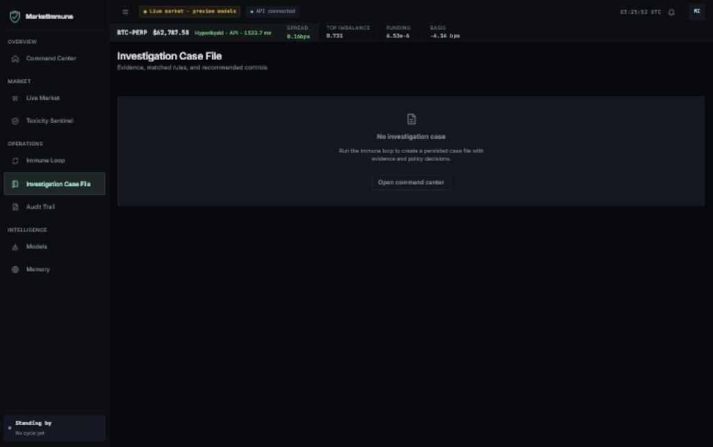
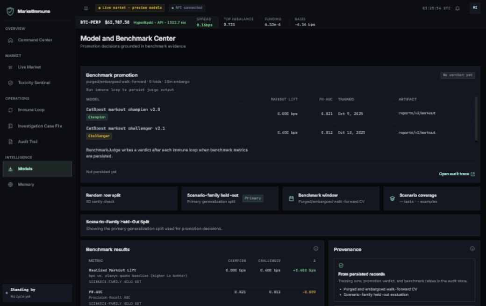
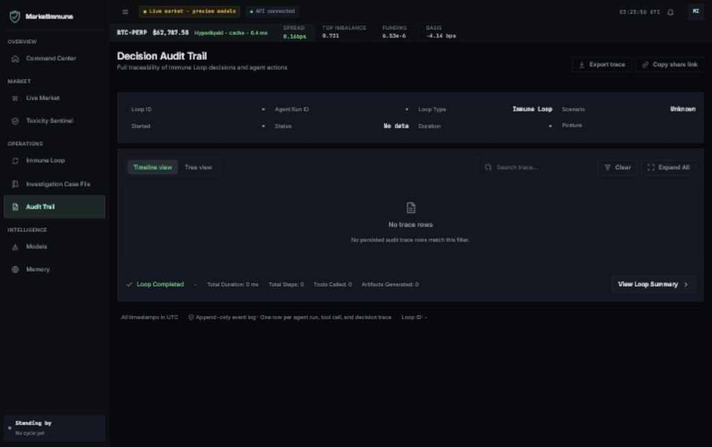

# MarketImmune

**Agentic market-safety research platform for crypto perpetuals.**
MarketImmune combines a terminal-style dashboard, a multi-agent immune loop with
an append-only audit trail, exchange-data ingestion groundwork, markout labeling
primitives, and leakage-safe evaluation into one research workspace.




-97fce4)


## What It Does

MarketImmune is a research prototype for detecting adverse selection and toxic
order flow in crypto perpetual markets. It is built around an immune-loop model:

```text
Generate -> Detect -> Investigate -> Decide -> Remember
```

The system is designed for market-structure monitoring, agentic investigations,
append-only decision audit trails, and real markout-based model evaluation.

## Current Status

This is a research system, not a live trading system.

What is live today in this repository:

- **React/Django market dashboard** with simulator, risk, model, memory, audit,
  and agentic-loop screens.
- **Django API surface** for `/api/live/tick/`, simulator state/control,
  risk-head health, promoted markout-model health, Hyperliquid public Info API
  market data, and agentic loop state/run endpoints.
- **Agentic immune loop** with structured traces and append-only audit records.
- **Exchange ingestion path** for Hyperliquid public API samples, current/recent
  replay seeds, and requester-pays historical Bronze/Silver/Gold backfills.
- **Markout labeling and evaluation** for real Hyperliquid fills, including a
  calibrated CatBoost report over local SOL training partitions and a
  Django/React promoted-artifact readout.
- **Leakage-aware evaluation tools** including purged/embargoed walk-forward
  splits, calibration metrics, and promotion policy checks.
- **Quality gates**: ruff, mypy, pytest, and a coverage gate ≥95%
  (CI-enforced).

What is still preview:

- Some agent/model dashboard views still include labeled fixtures.
- The current risk head trains on synthetic scenario data, not real exchange
  fills.
- The CatBoost report is a first local SOL panel proof, not yet a broad
  multi-day, multi-coin production benchmark.

The remaining roadmap is summarized below so the README stays self-contained.

## Screenshots

The gallery below shows the core product surfaces: Command Center, Live Market,
Toxicity Sentinel, Immune Loop, Investigation Case File, Model Center, and
Audit Trail. Each image is a bitmap capture of the running UI or a resized
bitmap derived from those captures.

| Command Center | Live Market |
|---|---|
|  |  |

| Toxicity Sentinel | Immune Loop |
|---|---|
|  |  |

| Investigation Case File | Model Center |
|---|---|
|  |  |

| Audit Trail |
|---|
|  |

## Highlights

- **Professional trading terminal UI**: dark Hyperliquid-inspired command
  surface, live ticker strip, candle chart, depth view, and dense data panels.
- **Auditable agents**: each stage emits structured `AgentRun`, `ToolCall`, and
  `DecisionTrace` records.
- **Market-data path**: Hyperliquid free API samples plus requester-pays
  historical L2, asset context, and node-fill backfills into parquet.
- **ML research stack**: gradient-boosting risk head today, plus an agentic
  CatBoost markout trainer/Judge path for real Gold rows.
- **Honesty-first metrics**: `[real-model]` no hard-coded market claims; the
  current real-data report trains on SOL `20260527..20260531` and holds out
  `20260601`. On the held-out day it reaches `PR-AUC=0.556`,
  `Brier=0.233`, `markout_lift_bps=0.860`, and `+0.109 bps` versus the
  event-OFI baseline. The Judge promotes CatBoost over that explicit event-OFI
  incumbent by comparing the quoting-policy candidate in
  [`policy.candidate_deployment_selection`](docs/benchmarks/hyperliquid_markout_SOL_20260527_20260531_holdout_20260601.json#L609)
  against
  [`policy.baseline_deployment_selection`](docs/benchmarks/hyperliquid_markout_SOL_20260527_20260531_holdout_20260601.json#L674);
  [`holdout_split.policy`](docs/benchmarks/hyperliquid_markout_SOL_20260527_20260531_holdout_20260601.json#L812),
  [`holdout_split.uncalibrated`](docs/benchmarks/hyperliquid_markout_SOL_20260527_20260531_holdout_20260601.json#L734),
  and
  [`holdout_split.baseline_comparison.event_ofi`](docs/benchmarks/hyperliquid_markout_SOL_20260527_20260531_holdout_20260601.json#L803)
  remain recorded in the same report.

### Benchmark Provenance

`[real-model]` The held-out SOL metrics above were reproduced in this session
with:

```powershell
python -m scripts.train_hyperliquid_markout --coin SOL --dates 20260527..20260531 --holdout-date 20260601 --horizon 10s --iterations 150 --n-splits 5 --report docs/benchmarks/hyperliquid_markout_SOL_20260527_20260531_holdout_20260601.json --model-out .tmp/benchmarks/hyperliquid_catboost_SOL_20260527_20260531_holdout_20260601_10s.cbm --calibrator-out .tmp/benchmarks/hyperliquid_catboost_SOL_20260527_20260531_holdout_20260601_10s.isotonic.json
```

Data source: local Hyperliquid Gold training parquet partitions under
`data/hyperliquid/gold/hyperliquid/training/SOL/`, train dates
`20260527..20260531`, holdout date `20260601`, produced by the requester-pays
Hyperliquid backfill path. Report artifact:
[docs/benchmarks/hyperliquid_markout_SOL_20260527_20260531_holdout_20260601.json](docs/benchmarks/hyperliquid_markout_SOL_20260527_20260531_holdout_20260601.json).

Note: the direct script-path form
`python scripts/train_hyperliquid_markout.py ...` failed in this Windows session
before training because the script imports `scripts.hyperliquid_markout_args`
and the repo root was not on `sys.path`. The module form above uses the same
training code and arguments from the repo root.

## Repository Map

```text
marketimmune/         Python core: agents, ingestion, labels, models, replay, policy
aegisbench/           Experimental benchmark harness; not part of the core narrative
dashboard/            Django app: API views, ORM persistence, audit trail, static SPA host
dashboard_project/    Django settings and URL root
frontend/             React + TypeScript + Vite terminal UI
scripts/              Backfill, training, verification, and bundle-sync CLIs
tests/                Unit, integration, parser, model, dashboard, and UI-adjacent tests
```

Python core code has no Django dependency. Django owns persistence and API
hydration. The React app can run static-first, then hydrate live slices when the
Django API is reachable. `frontend/` builds to `frontend/dist/`; when Django
should serve the latest SPA, `scripts/sync-django-bundle.mjs` removes
`dashboard/static/agentic/`, recreates it, and copies `frontend/dist/` there.

### AegisBench Disposition

`aegisbench/` is experimental benchmark scaffolding for benchmark-task experiments.
It remains in CI because it has package wiring, direct tests, and script consumers.
It is not part of the core MarketImmune application narrative.

The standalone Hindsight evaluation engine now lives at
[Zwc-11/Hindsight](https://github.com/Zwc-11/Hindsight). MarketImmune keeps its
own markout model evaluation and training paths here; the extracted backtesting
engine is no longer vendored in this repository.

See [ARCHITECTURE.md](ARCHITECTURE.md) for the ingest-to-audit flow.

## Quickstart

Install backend dependencies and start Django:

```powershell
python -m pip install -e '.[dev]'
python manage.py migrate
python manage.py runserver 127.0.0.1:8000
```

For requester-pays historical backfills and CatBoost training:

```powershell
python -m pip install -e '.[dev,hyperliquid,training]'
```

Open the current single-origin app:

```text
http://127.0.0.1:8000/dashboard/live/#/live
```

Current JSON endpoints include `/api/live/tick/`, `/api/simulator/state/`,
`/api/simulator/control/`, `/api/risk-head/health/`,
`/api/markout-model/health/`, and `/api/agentic/state/`.

For active frontend development:

```powershell
npm.cmd run setup:frontend
npm.cmd run dev:frontend
```

Then open:

```text
http://127.0.0.1:5173/#/live
```

Do not use `npm run preview` for live API testing. Static preview does not proxy
`/api`.

## Useful Commands

Run the full backend gate:

```powershell
python -m coverage run -m pytest
python -m coverage report -m
```

Run lint/type/build checks:

```powershell
ruff check .
mypy
npm.cmd run typecheck
npm.cmd run build
python manage.py check
python manage.py makemigrations --check --dry-run
```

Train the current synthetic-data risk head:

```powershell
python scripts/train_risk_head.py
```

Seed the current replay lake from the free Hyperliquid public API:

```powershell
python scripts/seed_hyperliquid_replay_lake.py --coin BTC --symbol BTCUSDT --lookback-minutes 120 --rows 90
```

Backfill one full SOL day from Hyperliquid requester-pays archives:

```powershell
python scripts/backfill_hyperliquid_day.py --coin SOL --date 20260601 --hour 0-23 --fill-hour 0-23 --lake-root data/hyperliquid
```

Rebuild the local Gold training table after feature changes, without another S3
download:

```powershell
python scripts/rebuild_hyperliquid_training_rows.py --coin SOL --date 20260601 --lake-root data/hyperliquid
```

Train the real-data CatBoost markout model from that Gold table:

```powershell
python -m scripts.train_hyperliquid_markout --coin SOL --date 20260601 --horizon 10s --iterations 150 --n-splits 5 --report reports/hyperliquid_markout_SOL_20260601.json --model-out data/models/hyperliquid_catboost_SOL_10s.cbm
```

That command also writes an isotonic calibrator next to the model:
`data/models/hyperliquid_catboost_SOL_10s.isotonic.json`.

Train across every local SOL partition currently available:

```powershell
python -m scripts.train_hyperliquid_markout --coin SOL --dates 20250727,20260601 --horizon 10s --iterations 150 --n-splits 5 --report reports/hyperliquid_markout_SOL_panel.json --model-out data/models/hyperliquid_catboost_SOL_panel_10s.cbm
```

Date ranges are strict by default: every requested Gold training parquet must
exist locally. For a smoke run over only the files already present, add
`--allow-missing-partitions`; the report records `missing_partitions`.

Run the same real-data training path through the agent framework:

```powershell
@'
from marketimmune.agentic.trainer import HyperliquidTrainingSpec, ModelTrainerAgent

agent = ModelTrainerAgent(
    training_mode="hyperliquid_markout",
    hyperliquid_spec=HyperliquidTrainingSpec(
        coin="SOL",
        dates=("20250727", "20260601"),
        horizon="10s",
    ),
)
run = agent.run(goal="train real Hyperliquid CatBoost candidate", force=True)
print(run.linked_artifacts["job"].to_dict())
'@ | python -
```

## Roadmap

The remaining high-value work is real-data execution:

- Scale requester-pays backfills beyond the current local SOL panel.
- Compare calibration stability across multiple days and coins.
- Feed live/replayed Gold fill features through the promoted scorer inside the
  Sentinel/Policy path.
- Continue replacing remaining fixture-only panels with persisted evidence.

## Scope Notes

- No real orders are sent.
- No private key or exchange account is required for the current dashboard.
- LLM access is optional for richer agent reasoning; deterministic fallbacks
  work without external model access.
- Cite the current CatBoost metric only as a local SOL panel proof until the
  broader multi-day, multi-coin benchmark exists.
