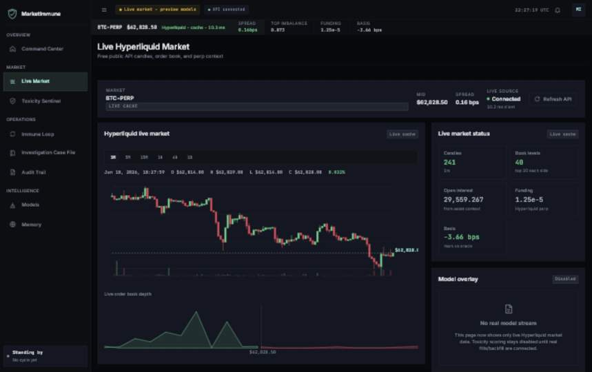

# MarketImmune

**Agentic market-safety research platform for Hyperliquid perpetuals.**
MarketImmune combines a live BTC-PERP terminal, an audited multi-agent immune
loop, exchange data ingestion, markout labeling, and leakage-safe model
evaluation into one research workspace.




## What It Does

MarketImmune is a research prototype for detecting adverse selection and toxic
order flow in crypto perpetual markets. It is built around an immune-loop model:

```text
Generate -> Detect -> Investigate -> Decide -> Remember
```

The system monitors live Hyperliquid market structure, runs agentic
investigations, persists every decision to an audit trail, and provides the
scaffolding for real markout-based model evaluation.

## Current Status

This is a research system, not a live trading system.

What is live today:

- **Live Hyperliquid market dashboard** for BTC-PERP candles, order-book depth,
  spread, funding, basis, open interest, and top-of-book imbalance.
- **Django API surface** for `/api/hyperliquid/live/` and
  `/api/hyperliquid/candles/`.
- **Agentic immune loop** with structured traces and append-only audit records.
- **Exchange ingestion groundwork** for Binance public data and Hyperliquid
  public Info API samples.
- **Markout labeling and evaluation primitives** for future real-data model
  training.
- **Leakage-aware evaluation tools** including purged/embargoed walk-forward
  splits, calibration metrics, and promotion policy checks.
- **Quality gates**: mypy clean, ruff clean, frontend typecheck/build clean, and
  100% backend coverage.

What is still preview:

- Agent/model dashboard views still include labeled fixtures.
- The current risk head trains on synthetic scenario data, not real
  Hyperliquid fills.
- The CatBoost markout model and measured bps lift require the historical
  requester-pays backfill and training run.

For the exact implementation ledger, see
[`AUDIT_AND_PLAN.md`](AUDIT_AND_PLAN.md).

## Highlights

- **Professional trading terminal UI**: dark Hyperliquid-inspired command
  surface, live ticker strip, candle chart, depth view, and dense data panels.
- **Auditable agents**: each stage emits structured `AgentRun`, `ToolCall`, and
  `DecisionTrace` records.
- **Real market-data path**: free Hyperliquid Info API support for current L2,
  candles, mids, and asset context.
- **Historical-data path**: parser and lakehouse scaffolding for Hyperliquid
  requester-pays archive data.
- **ML research stack**: gradient-boosting risk head today, CatBoost markout
  evaluation path planned once real Gold rows exist.
- **Honesty-first metrics**: no hard-coded market claims; resume-grade numbers
  wait for measured real-data reports.

## Architecture

```text
marketimmune/         Python core: agents, ingestion, labels, models, replay
dashboard/            Django REST API, ORM audit trail, static React host
frontend/             React + TypeScript + Vite terminal UI
aegisbench/           Benchmark tasks, splits, metrics, and reports
scripts/              Training, backfill, live sample, and verification CLIs
tests/                Unit, integration, parser, model, and dashboard tests
```

Python core code has no Django dependency. Django owns persistence and API
hydration. The React app can run static-first, then hydrate live slices when the
Django API is reachable.

## Quickstart

Install backend dependencies and start Django:

```powershell
python -m pip install -e ".[dev]"
python manage.py migrate
python manage.py runserver 127.0.0.1:8000
```

Open the current single-origin app:

```text
http://127.0.0.1:8000/dashboard/live/#/live
```

Optional live-data settings in `.env`:

```ini
MARKETIMMUNE_HYPERLIQUID_COIN=BTC
MARKETIMMUNE_HYPERLIQUID_BUDGET_MS=2000
MARKETIMMUNE_HYPERLIQUID_CACHE_TTL_MS=5000
MARKETIMMUNE_HYPERLIQUID_CANDLE_INTERVAL=1m
MARKETIMMUNE_HYPERLIQUID_CANDLE_LOOKBACK_MINUTES=240
MARKETIMMUNE_HYPERLIQUID_CANDLE_CACHE_TTL_MS=30000
```

For active frontend development:

```powershell
npm.cmd run setup:frontend
npm.cmd run dev:frontend
```

Then open:

```text
http://127.0.0.1:5173/#/live
```

Do not use `npm run preview` for live API testing. Static preview does not proxy
`/api`.

## Useful Commands

Run the full backend gate:

```powershell
python -m coverage run -m pytest
python -m coverage report -m
```

Run lint/type/build checks:

```powershell
ruff check .
mypy
npm.cmd run typecheck
npm.cmd run build
python manage.py check
python manage.py makemigrations --check --dry-run
```

Fetch a small free Hyperliquid public API sample:

```powershell
python scripts/fetch_hyperliquid_api_sample.py --coin BTC --interval 1m --lookback-minutes 60
```

Train the current synthetic-data risk head:

```powershell
python scripts/train_risk_head.py
```

## Roadmap

The remaining high-value work is real-data execution:

- Confirm the exact Hyperliquid `node_fills_by_block` archive schema.
- Run the requester-pays historical backfill.
- Assemble Bronze/Silver/Gold rows with point-in-time features and markout
  labels.
- Train CatBoost under purged/embargoed walk-forward CV.
- Report measured markout lift in bps versus an OFI-only baseline.
- Wire the trained model stream back into the live product loop.

## Scope Notes

- No real orders are sent.
- No private key or exchange account is required for the live market dashboard.
- DeepSeek is optional for richer agent reasoning; deterministic fallbacks work
  without LLM access.
- Do not cite market-performance claims until the real historical training run
  produces a measured report.
